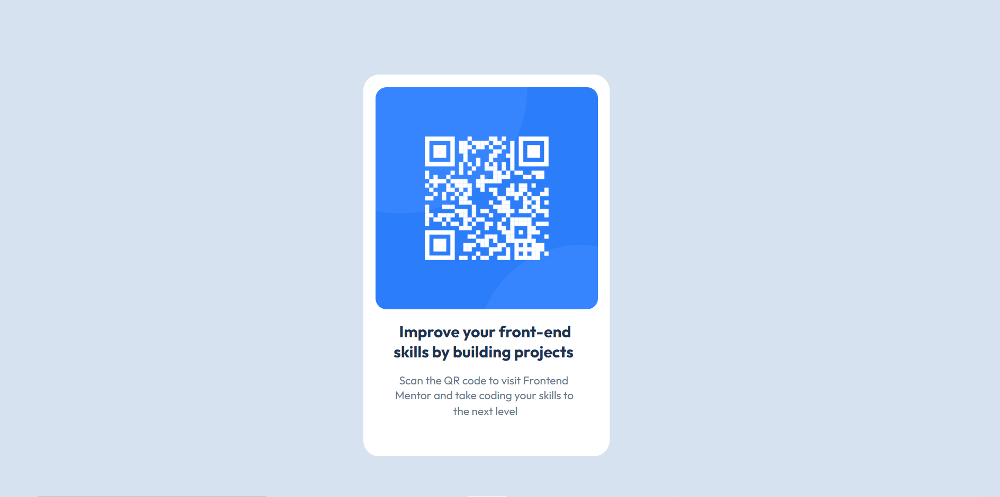

# QR Code Component

A responsive QR Code Component built using **HTML** and **CSS** as part of the Frontend Mentor challenges.

## 📸 Preview



## 🔗 Live Demo

- Live Site: https://vishwakarma-varun.github.io/QR-code-component/

## 🚀 Built With

- HTML5
- CSS3
- Flexbox
- Responsive Design
- Google Fonts (Outfit)

## 📚 What I Learned

While building this project, I practiced:

- Semantic HTML
- CSS Box Model
- Flexbox for centering elements
- Responsive layouts using `max-width`
- Using Google Fonts
- Image sizing with `width: 100%`
- CSS pseudo-elements and selectors
- Git & GitHub Pages deployment

## 📁 Project Structure

```
qr-code-component/
│
├── images/
│   └── image-qr-code.png
├── index.html
├── style.css
├── preview.jpg
└── README.md
```

## 💡 Challenges Faced

Some of the problems I solved while building this project:

- Making the card responsive
- Centering the card vertically and horizontally
- Making the QR image fit inside the card
- Understanding `max-width` and responsive units
- Hosting the project using GitHub Pages

## 📖 Acknowledgements

This project is part of the challenges provided by **Frontend Mentor**.

- https://www.frontendmentor.io

## 👨‍💻 Author

**Varun Vishwakarma**

- GitHub: https://github.com/Vishwakarma-Varun
- Frontend Mentor: https://www.frontendmentor.io/profile/Vishwakarma-Varun# QR Code Component

A responsive QR Code Component built using **HTML** and **CSS** as part of the Frontend Mentor challenges.

## 👨‍💻 Author

**Varun Vishwakarma**

- GitHub: https://github.com/Vishwakarma-Varun
- Frontend Mentor: https://www.frontendmentor.io/profile/Vishwakarma-Varunv
